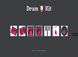

# Hi there 👋

## I am a Full Stack Software Developer and a Certified Cybersecurity Professional 💻🖥️

## Projects

 **Onile Phase 2**

 **Onile Phase 1**

 **Simon Game**

 **Play It**

 **Dicee World**

 **GTP-3**

 **Calculator**

 **Teach4Dev Clone**

## Technical Skills

### Frontend

- HTML5;
- CSS3;
- CSS Frameworks (BootstrapCSS, TailwindCss, FramerMotion);
- Vanilla JavaScript;
- JavaScript Frameworks (JQuery, ReactJS, NextJS).

### Backend

- NodeJS;
- ExpressJS;
- Embedded JavaScript (EJS);

### Cybersecurity

- Kali Linux;
- Nmap;
- Nessus;
- Hydra;
- Metasploit;
- OSINT.

### Others

- Git and Github;
- Version Control.

## Soft Skills

- Effective Communication;
- Team Collaboration;
- Time Management;
- Leadership.

<!--
**topzyray/topzyray** is a ✨ _special_ ✨ repository because its `README.md` (this file) appears on your GitHub profile.

Here are some ideas to get you started:

- 🔭 I’m currently working on ...
- 🌱 I’m currently learning ...
- 👯 I’m looking to collaborate on ...
- 🤔 I’m looking for help with ...
- 💬 Ask me about ...
- 📫 How to reach me: ...
- 😄 Pronouns: ...
- ⚡ Fun fact: ...
-->
